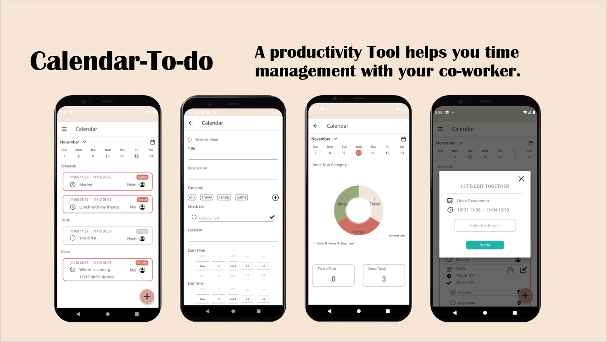
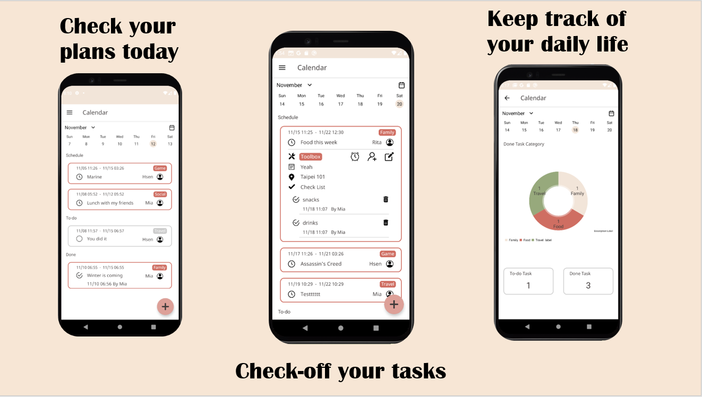
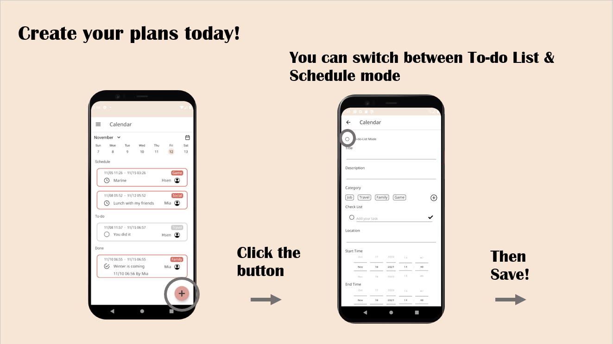
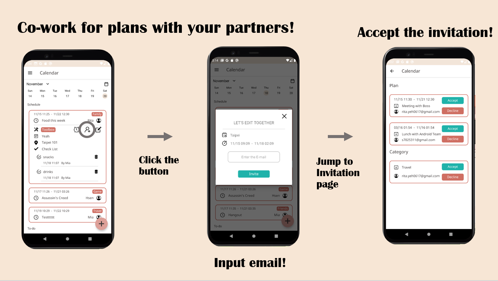
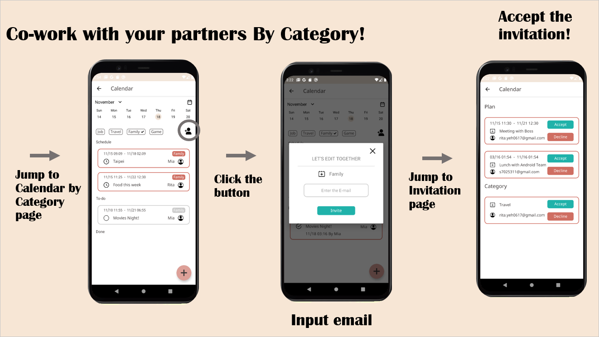
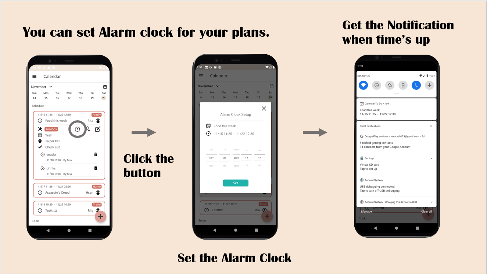
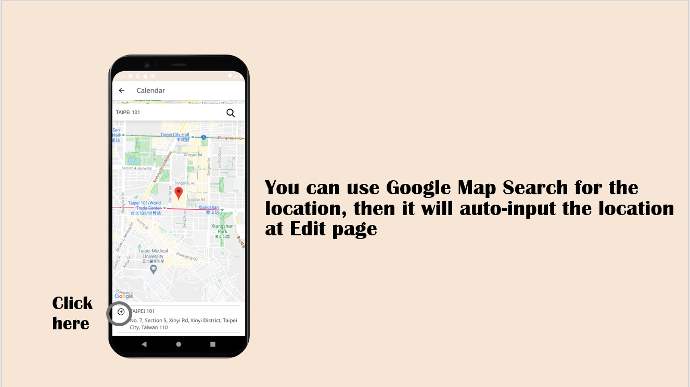

# Calendar-to-do
A Calendar App combined with To-do List that helps you time management with your friends, family, and co-workers.

## Features
- Check your plans today, tomorrow, or next week
- Check off your tasks when you accomplish them
- Keep track of your daily life by Pie-Chart
- Edit your plans; you can switch between To-do list and Schedule mode
- Co-work the plans with your partners by sending emails
- Set alarm clock for your plans
- AutoInput the address when you input the keyword

## More introduction about Features

## Support
- Programming Language: Kotlin
- Android Jetpack Library (Data binding, Navigation, Livedata...)
- Design pattern: Object-Oriented Programming, Model-View-ViewModel, Observer
- Data management: Firestore, Firebase Authentication, Crashlytics
- Third-party SDK: Facebook SDK, Google SDK (Google Login API, Google Map API, Google Place API)
- Github open source: Collapsible-Calendar-View, MPAndroidChart
- Animation: Lottie

## Requirement
- Android Studio Artic Fox | 2020.3.1
- Android SDK 29+